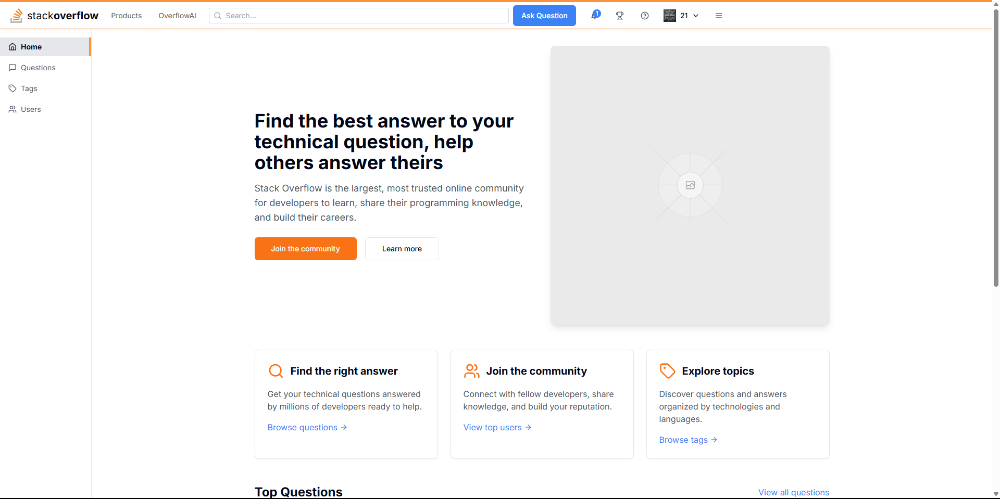
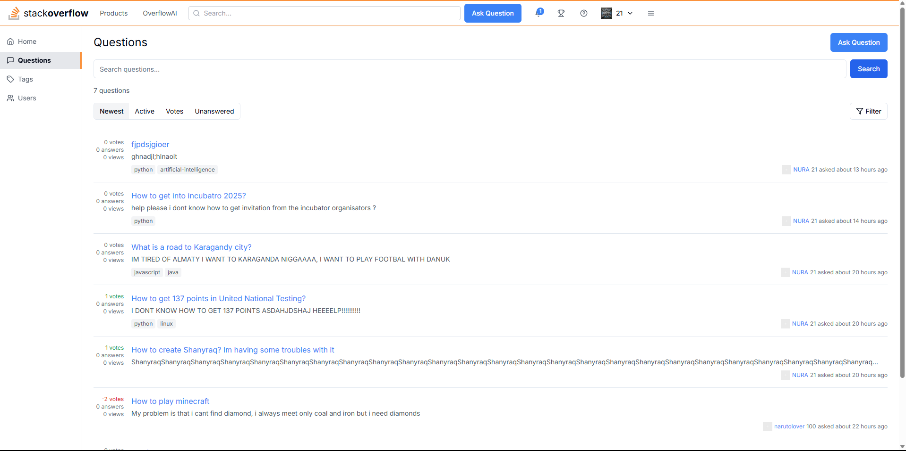
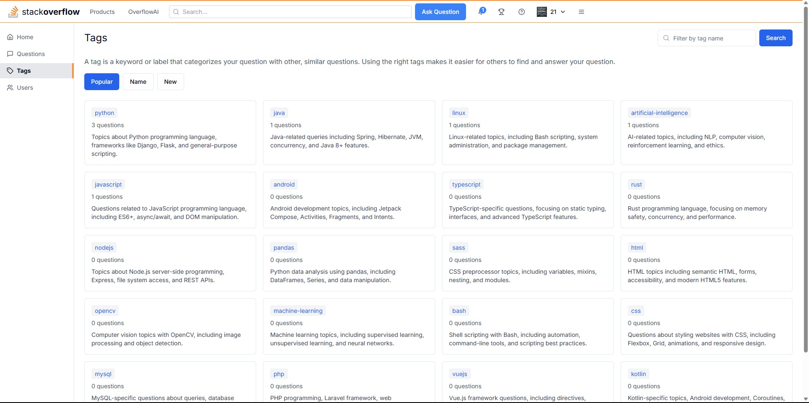

# StackOverflow Clone

Stack Overflow Clone — platform for sharing questions and answers in IT and techno sphere, with tag, voting, search and user profile with reputation and full editing support.

## Website link

👉 [Go to website](https://sof-frontend-fsxb.vercel.app/)  

### Main page


### Question page


### Tags



## Tech stack

### Backend:
- Python
- Django Rest Framework
- PostgreSQL

### Frontend:
- Next.js
- Axios

### Extra:
- Docker (optional)
- Gunicorn (on deploy)

## Deploy

- **Frontend**: [Vercel](https://vercel.com/)  
- **Backend**: [AWS EC2]
- **Database**: PostgreSQL on Supabase

## Local run

**Backend**  
```bash
cd backend
pip install -r requirements.txt
python manage.py runserver
